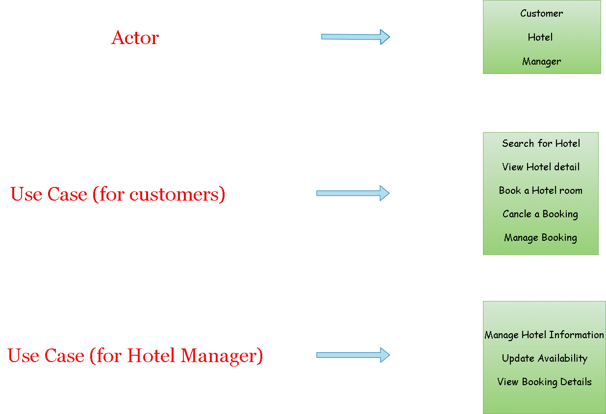

# Requirement-analysis

## Requirement Analysis in Software Development
- This repository serves as a comprehensive guide to the foundational phase of software development: Requirement Analysis. It documents the detailed process of analyzing and structuring requirements for a Booking Management System, emphasizing clarity, precision, and best practices. By exploring key concepts, activities, and visual representations, this repository highlights the critical role of Requirement Analysis in ensuring the success of software projects and aligning outcomes with user and business needs.

## What is Requirement Analysis?
### Definition and Overview
Requirement Analysis is a systematic and critical process within the Software Development Lifecycle (SDLC) that serves as the foundational stage for successful software project delivery. It is the comprehensive approach of identifying, documenting, analyzing, and validating a proposed software system's specific needs, constraints, and objectives.

### Role in the Software Development Lifecycle

#### SDLC Stage Positioning
In the broader context of the Software Development Lifecycle, Requirement Analysis is the earliest and most crucial phase, typically referred to as the "Requirements" or "Planning" stage. Its strategic positioning ensures that all subsequent stages of development are built upon a solid, well-understood foundation.

#### Comprehensive Process Breakdown
The requirement analysis process encompasses several interconnected activities:

1. Requirement Identification
   - Engaging with stakeholders
   - Discovering explicit and implicit project needs
   - Understanding business goals and user expectations

2. Requirement Gathering
   - Conducting interviews with key stakeholders
   - Distributing surveys and questionnaires
   - Organizing workshops and focus groups
   - Analyzing existing system documentation

3. Requirement Documentation
   - Creating detailed requirement specification documents
   - Developing use case diagrams
   - Defining functional and non-functional requirements
   - Establishing clear acceptance criteria

### Importance in the Software Development Lifecycle

#### 1. Risk Mitigation
- Identifies potential project challenges early
- Reduces the likelihood of costly reworks
- Prevents misalignment between stakeholder expectations and project outcomes

#### 2. Cost Optimization
- Minimizes unnecessary development expenses
- Helps in accurate budget planning
- Prevents feature creep and scope expansion

#### 3. Stakeholder Alignment
- Creates a common understanding of project objectives
- Ensures all parties have a shared vision
- Facilitates clear communication between technical and non-technical stakeholders

#### 4. Quality Assurance
- Establishes clear acceptance criteria
- Provides a benchmark for testing and validation
- Ensures the final product meets predefined requirements

### Relationship with Other SDLC Stages

#### Planning Stage
- Provides initial project blueprint
- Defines project scope and boundaries
- Supports resource allocation decisions

#### Design Stage
- Serves as input for system architecture
- Guides technical design choices
- Helps in creating detailed system specifications

#### Development Stage
- Provides clear implementation guidelines
- Offers a reference point for developers
- Helps in maintaining project focus

#### Testing Stage
- Establishes acceptance criteria
- Defines test scenarios
- Supports comprehensive quality assurance

#### Maintenance Stage
- Offers historical context for future improvements
- Provides documentation for system understanding
- Supports long-term system evolution

### Key Challenges in Requirement Analysis

1. Stakeholder Communication
   - Managing diverse and sometimes conflicting expectations
   - Translating business needs into technical specifications
   - Ensuring comprehensive requirement capture

2. Requirement Volatility
   - Handling changing business environments
   - Managing evolving user needs
   - Maintaining flexibility while maintaining project focus

3. Complexity Management
   - Dealing with intricate system interactions
   - Balancing detailed specifications with system simplicity
   - Understanding complex business processes

### Best Practices

1. Comprehensive Stakeholder Engagement
   - Involve representatives from all user groups
   - Conduct multiple interaction sessions
   - Use diverse requirement-gathering techniques

2. Clear Documentation
   - Use standardized documentation formats
   - Maintain traceability of requirements
   - Keep documentation up-to-date

3. Continuous Validation
   - Regularly review and validate requirements
   - Implement iterative refinement
   - Maintain open communication channels

### Modern Trends

1. Agile Requirement Analysis
   - Embracing iterative and flexible approaches
   - Supporting rapid development methodologies
   - Focusing on continuous stakeholder collaboration

2. Technology-Enabled Requirement Management
   - Utilizing advanced requirement management tools
   - Implementing collaborative platforms
   - Leveraging AI and machine learning for requirement prediction

### Conclusion
Requirement Analysis is not just a preliminary step but the strategic foundation that determines the trajectory of the entire software development process. Its meticulous approach ensures that software solutions are not just technically sound, but fundamentally aligned with business objectives and user needs.

## Why is Requirement Analysis Important?

Requirement Analysis is a critical strategic process in software development that ensures project success by addressing key challenges in the Software Development Lifecycle (SDLC).

### 1. Risk Reduction and Cost Management

Requirement Analysis serves as a proactive risk management tool by:
- Identifying potential challenges early
- Preventing costly reworks and project redirections
- Reducing development costs by up to 50%
- Minimizing the expense of late-stage requirement changes

### 2. Stakeholder Alignment and Communication

The process creates a unified project vision by:
- Bridging communication between stakeholders
- Aligning expectations across:
  * Business teams
  * Development teams
  * End-users
  * Project managers
- Establishing clear project objectives and constraints
- Resolving potential conflicts before development begins

### 3. Quality Assurance and Product Effectiveness

Requirement Analysis ensures high-quality outcomes by:
- Defining clear success criteria
- Establishing benchmarks for:
  * Product functionality
  * Performance expectations
  * User experience
- Developing solutions that truly solve user problems
- Aligning technical solutions with business goals

### Key Benefits

- Provides a comprehensive development roadmap
- Supports flexible and scalable system design
- Enables more accurate project planning
- Improves overall project predictability

### Real-World Impact

Organizations implementing robust requirement analysis typically see:
- 20-30% reduction in development time
- Increased customer satisfaction
- Higher project success rates
- Improved return on investment

### Metaphorical Insight

Think of Requirement Analysis like an architect's blueprint - meticulously planning every aspect to ensure the final product meets client needs precisely.

### Conclusion

Requirement Analysis transforms abstract software visions into clear, actionable plans that align technology with business objectives, making it an indispensable investment in project success.

## Key Activities in Requirement Analysis
Requirement Analysis is a structured process that involves several key activities to ensure that the software being developed meets the needs of stakeholders and adheres to business goals
### Requirement Gathering
- This activity focuses on collecting initial project needs from all relevant stakeholders, including business owners, users, and technical teams.
- Methods such as surveys, interviews, and brainstorming sessions are used to gather requirements.
- It helps in understanding the business context, goals, and any specific needs or challenges that the software must address.
### Requirement Elicitation
 - Requirement Elicitation involves actively engaging stakeholders to refine, clarify, and prioritize the requirements.
 - Techniques such as interviews, workshops, focus groups, and use case analysis are commonly employed.
 - It aims to uncover implicit requirements and fully understand stakeholders' expectations.
### Requirement Documentation
- Once the requirements are gathered and elicited, they must be documented clearly and concisely.
- This documentation typically includes detailed descriptions of functional and non-functional requirements, user stories, and system constraints.
- Well-structured documentation is the reference point throughout the project, ensuring that all stakeholders are aligned.
### Requirement Analysis and Modeling
- In this phase, the collected and documented requirements are analyzed to identify inconsistencies, ambiguities, and gaps.
- Modeling techniques like use case diagrams, flowcharts, and data flow diagrams are used to visualize the requirements and system interactions.
- This helps in understanding the system’s behavior, interactions, and data flow, and is essential for creating a functional design.
### Requirement Validation 
- Verify that the documented requirements accurately reflect the stakeholders' needs.
- Ensure stakeholders are involved in validation to confirm the requirements are clear and meet their expectations.
- This step helps to identify and resolve any issues early in the project lifecycle, minimizing risks during the development and testing phases.

- 
## Types of Requirements
### Functional Requirements for a booking management project
- Users should be able to search for hotels based on various criteria like location, date, price, and amenities
- Users should be able to view detailed information about each hotel, including photos, descriptions, and reviews
- Users should be able to book a hotel room and receive confirmation.
- The system should integrate with a payment gateway to facilitate secure online transactions.
- The system should allow users to cancel or modify their bookings.
### Non-functional Requirements for the booking management project
- The system should respond to user queries quickly (e.g., search results should be displayed within seconds).
- The system should be secure and protect user data from unauthorized access.
- The system should be user-friendly and easy to navigate for both customers and hotel administrators.
- The system should be scalable to accommodate a growing number of users and bookings
- The system should be available 24/7 with minimum downtime

## Use Case Diagrams
* Use Case Diagrams are visual representations of the interactions between actors (users or external systems) and the system being developed. They show the functionalities 
  (use cases) that the system provides for each actor. Use Case Diagrams are beneficial for:

- Identifying and understanding system functionalities.
- Visualizing interactions between users and the system.
- Improving communication between developers and stakeholders.

### Use Case Diagrams

## Acceptance Criteria 
### Acceptance Criteria Defination
- Acceptance Criteria are specific conditions that a feature or functionality must meet to be considered complete and successful.They act as a bridge between the development team and stakeholders, ensuring everyone is aligned on what the final product should achieve.
### Importance of Acceptance Criteria in Requirement Analysis
**Clarity and Conciseness** : Acceptance Criteria translate high-level requirements into clear, testable statements.This eliminates ambiguity and ensures the development team understands the desired outcome
**Verifiable Conditions**: Each criterion should be defined in a way that allows for verification through testing. This helps confirm that the implemented functionality meets the user's needs.
**Improved Communication** : Acceptance Criteria facilitate better communication between developers, testers, and stakeholders. Everyone involved can refer to these criteria to understand the expected behavior of the system.
### Example: Acceptance Criteria for Checkout Feature in Booking Management System
**Feature: Checkout** :
- Description : This feature allows users to review their booking details, select a payment method, and confirm their booking.
  
**Acceptance Criteria** :
1. User can review booking details:
- The user interface should display the selected hotel, room type, dates, and total cost of the booking.
- Any additional fees or taxes should be clearly listed.
2. User can select a payment method
- The system should offer multiple payment methods (e.g., credit card, debit card, online wallets).
- Each payment method should have a clear and recognizable icon.
3. User can enter payment information securely
- The payment gateway should be secure and use industry-standard encryption protocols.
- The user interface should not display sensitive information like credit card numbers in plain text.

